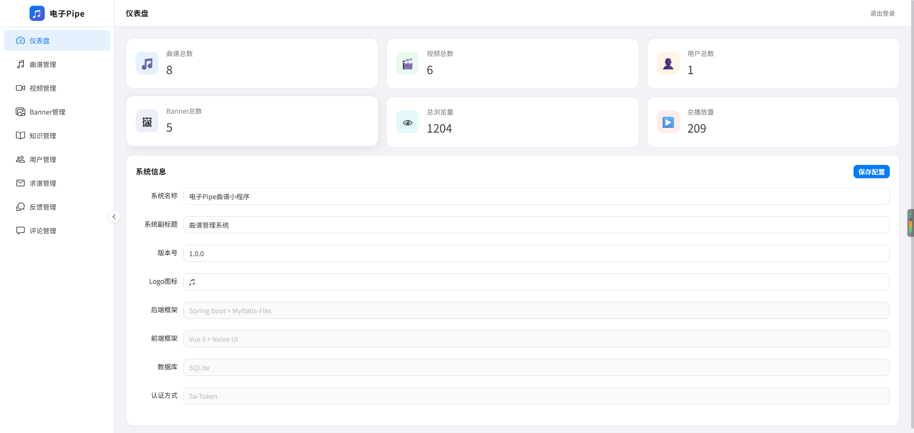
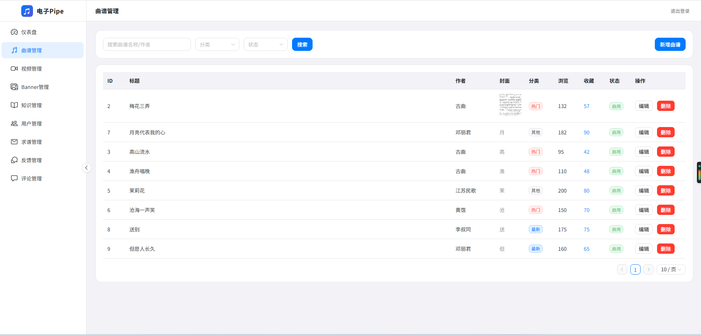
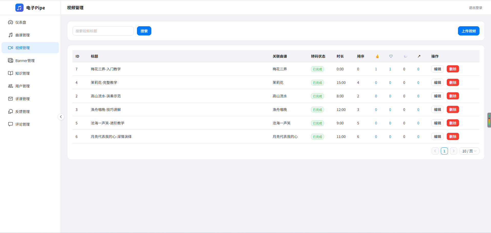
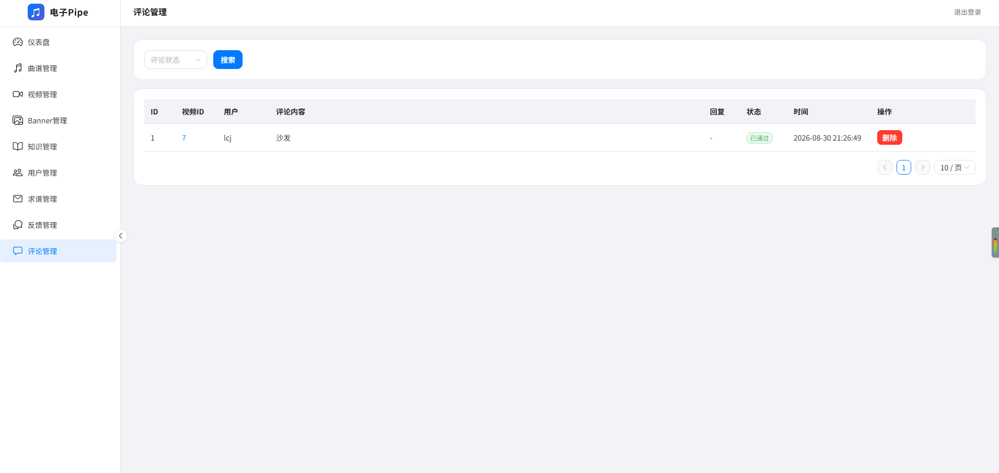
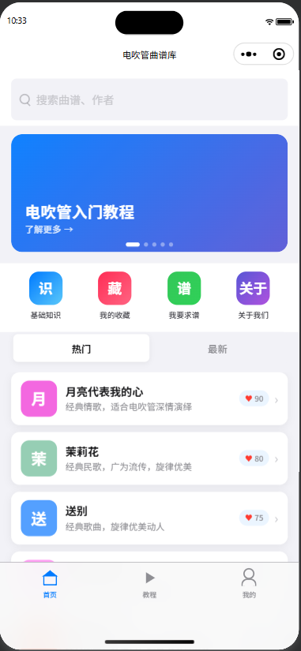
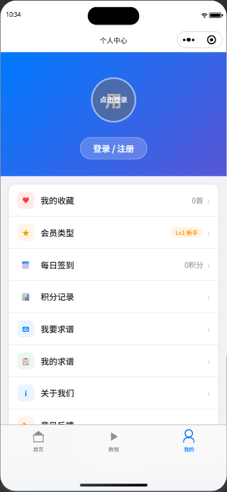

# 电吹管曲谱库小程序

> 电吹管爱好者的曲谱资源平台，提供曲谱搜索、浏览、收藏、视频教程等功能。

## 技术栈

| 组件 | 选择 | 版本 |
|------|------|------|
| 前端 | uni-app (Vue3 + Vite5 + TS) | latest |
| 管理端 | Vue3 + Naive UI + Vite5 | latest |
| 后端 | Spring Boot | 4.1.1 |
| JSON | Jackson 3 (tools.jackson) | 3.1.5 |
| JDK | OpenJDK | 26.0.2.1 |
| ORM | MyBatis-Flex | 1.11.8 |
| 安全 | Sa-Token | 1.46.0 |
| 存储 | x-file-storage | 2.3.0 |
| 数据库 | SQLite (开发) / MySQL (生产) | - |

## 快速开始

### 环境要求

- **JDK 26+**：建议使用 JDK 26 或更高版本，安装路径按本机实际位置配置
- **Maven 3.8.3+**：构建后端依赖，安装路径按本机实际位置配置
- **Node.js 18+**: 用于前端开发

### 一键启动

```bash
# Windows
start.bat

# 或手动启动
# 后端
cd server
:: 请将下面两行的路径替换为你本机的 JDK 与 Maven 安装路径
set JAVA_HOME=<你的JDK路径，如 D:\Software\Java\jdk-26.0.2.1>
set PATH=<你的Maven\bin路径>;%JAVA_HOME%\bin;%PATH%
mvn spring-boot:run

# 前端
cd client
npm install
npm run dev:h5

# 管理端
cd admin
npm install
npm run dev
```

### 默认账号

| 系统 | 用户名 | 密码 |
|------|--------|------|
| 管理后台 | admin | admin123 |

> 管理后台地址：http://localhost:3001

### 微信小程序凭据

微信登录依赖 `wx.appid` 与 `wx.appsecret`，**请勿将真实值硬编码进仓库**。两种本地注入方式（均不会入库）：

- 环境变量：`set WX_APPID=你的AppID` 与 `set WX_APPSECRET=你的AppSecret`（Linux/macOS 用 `export`）
- 本地文件：在 `server/src/main/resources/application-local.yml` 中填写，该文件已被 `.gitignore` 忽略

未配置时微信登录接口会返回提示，不影响其余功能本地运行。

### 访问地址

- **前端**: http://localhost:5173
- **管理端**: http://localhost:3001
- **后端 API**: http://localhost:8080

### 停止服务

```bash
stop.bat
```

## 项目结构

```
electronic-pipe-miniapp/
├── client/                    # 小程序前端
│   ├── src/
│   │   ├── api/              # API 模块
│   │   ├── components/       # 公共组件
│   │   ├── pages/            # 页面
│   │   └── utils/            # 工具函数
│   └── package.json
├── admin/                     # 管理后台
│   ├── src/
│   │   ├── api/              # API 模块
│   │   ├── components/       # 公共组件
│   │   ├── router/           # 路由
│   │   ├── views/            # 页面
│   │   └── utils/            # 工具函数
│   └── package.json
├── server/                    # 后端服务
│   ├── src/main/java/com/score/
│   │   ├── config/           # 配置类
│   │   ├── controller/       # 控制器
│   │   ├── entity/           # 实体类
│   │   ├── mapper/           # Mapper 接口
│   │   └── service/          # 服务层
│   └── pom.xml
├── start.bat                  # 一键启动
├── stop.bat                   # 一键停止
└── scaffold.cfg               # 配置文件
```

## 功能特性

### 首页
- 🔍 曲谱搜索
- 🖼️ Banner 轮播
- 📑 Tab 切换（热门/最新/收藏）
- 📋 曲谱列表

### 曲谱详情
- 📄 曲谱图片展示
- 📥 下载功能
- ❤️ 收藏/取消收藏
- 📤 分享功能
- 🎬 视频教程（M3U8/HLS 播放）

### 基础知识
- 📚 横向 Tab 切换
- 📝 富文本内容展示
- 🎵 电吹管介绍/历史/品牌/指法

### 个人中心
- 👤 用户信息展示
- ❤️ 我的收藏
- 📝 我要求谱
- 💬 联系客服
- 📱 关于我们

### 管理后台
- 📊 数据看板
- 🎵 曲谱管理（CRUD + 图片/曲谱/视频上传）
- 🎬 视频管理（上传 + HLS 转码）
- 🖼️ Banner 管理
- 📝 知识管理
- 💬 评论管理
- 📋 求谱管理
- 👥 用户管理
- ⚙️ 系统配置

## 示例








## API 文档

### 用户相关

| 方法 | 路径 | 说明 | 需登录 |
|------|------|------|--------|
| POST | `/api/user/login` | 微信登录 | ❌ |
| GET | `/api/user/info` | 获取用户信息 | ✅ |
| POST | `/api/user/logout` | 退出登录 | ✅ |

### 曲谱相关

| 方法 | 路径 | 说明 | 需登录 |
|------|------|------|--------|
| GET | `/api/song/list` | 曲谱列表 | ❌ |
| GET | `/api/song/detail/{id}` | 曲谱详情 | ❌ |

### 收藏相关

| 方法 | 路径 | 说明 | 需登录 |
|------|------|------|--------|
| GET | `/api/favorite/list` | 收藏列表 | ✅ |
| POST | `/api/favorite/add` | 添加收藏 | ✅ |
| POST | `/api/favorite/remove` | 取消收藏 | ✅ |

### 知识相关

| 方法 | 路径 | 说明 | 需登录 |
|------|------|------|--------|
| GET | `/api/knowledge/list` | 知识列表 | ❌ |

### 视频相关

| 方法 | 路径 | 说明 | 需登录 |
|------|------|------|--------|
| GET | `/api/video/list` | 视频列表（按曲谱） | ❌ |
| GET | `/api/video/detail/{id}` | 视频详情（增加播放计数） | ❌ |

### Banner 相关

| 方法 | 路径 | 说明 | 需登录 |
|------|------|------|--------|
| GET | `/api/banner/list` | Banner列表 | ❌ |

### 管理端相关

| 方法 | 路径 | 说明 |
|------|------|------|
| POST | `/api/admin/login` | 管理员登录 |
| GET | `/api/admin/dashboard` | 数据看板 |
| GET | `/api/admin/song/list` | 曲谱列表 |
| POST | `/api/admin/song/add` | 添加曲谱 |
| POST | `/api/admin/song/update` | 更新曲谱 |
| POST | `/api/admin/song/delete/{id}` | 删除曲谱 |
| GET | `/api/admin/video/list` | 视频列表 |
| GET | `/api/admin/video/detail/{id}` | 视频详情（不增加播放计数） |
| POST | `/api/admin/video/add` | 添加视频 |
| POST | `/api/admin/video/delete/{id}` | 删除视频 |
| GET | `/api/admin/banner/list` | Banner列表 |
| POST | `/api/admin/banner/add` | 添加Banner |
| POST | `/api/admin/banner/delete/{id}` | 删除Banner |
| GET | `/api/admin/knowledge/list` | 知识列表 |
| POST | `/api/admin/knowledge/update` | 更新知识 |
| GET | `/api/admin/comment/list` | 评论列表 |
| POST | `/api/admin/comment/delete/{id}` | 删除评论 |
| GET | `/api/admin/feedback/list` | 求谱列表 |
| GET | `/api/admin/user/list` | 用户列表 |

## 开发说明

### 数据库

开发阶段使用 SQLite，数据文件位于 `server/score.db`。

如需切换到 MySQL，修改 `server/src/main/resources/application.yml`:

```yaml
spring:
  datasource:
    driver-class-name: com.mysql.cj.jdbc.Driver
    url: jdbc:mysql://localhost:3306/score_db
    username: root
    password: your_password
```

### 文件存储

项目集成 x-file-storage 统一文件存储抽象层，开发阶段使用本地存储。如需切换到 RustFS/MinIO，修改配置即可。

### 视频播放

视频采用 M3U8/HLS 格式，支持边下边播。后端自动将上传的 MP4 视频转码为 HLS。

如需添加视频转码功能，需安装 FFmpeg 并配置：

```yaml
video:
  transcode:
    enabled: true
    ffmpeg-path: /path/to/ffmpeg
```

### 时间格式化

Spring Boot 4 使用 Jackson 3（`tools.jackson`），jsr310 模块已内置在 jackson-databind 中。全局时间格式化通过 `JsonMapperBuilderCustomizer` + `SimpleModule` 配置，所有 `LocalDateTime` 字段自动格式化为 `yyyy-MM-dd HH:mm:ss`，`LocalDate` 格式化为 `yyyy-MM-dd`。

## 示例数据

项目启动时会自动导入以下示例数据：

- **曲谱**: 20+ 首（古曲、民歌、流行、影视金曲、入门必学）
- **知识**: 9 条（介绍、历史、品牌、指法）
- **视频**: 4 个（教学视频）
- **Banner**: 2 个（轮播图）

## 后续计划

- [x] ~~微信登录集成~~（已实现）
- [x] ~~评论功能~~（已实现，支持树形回复 + 积分）
- [ ] RustFS/MinIO 存储对接（x-file-storage 已集成，切换只需改配置）
- [ ] 会员系统
- [ ] 社交功能（关注、动态等）

## 许可证

MIT License